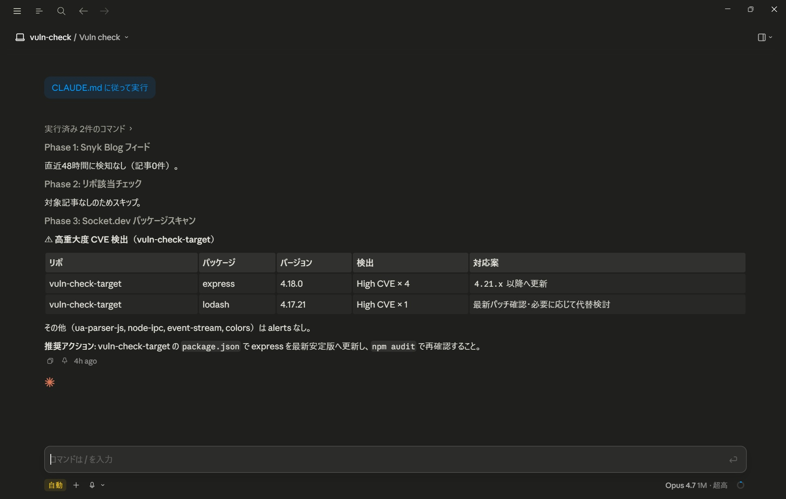
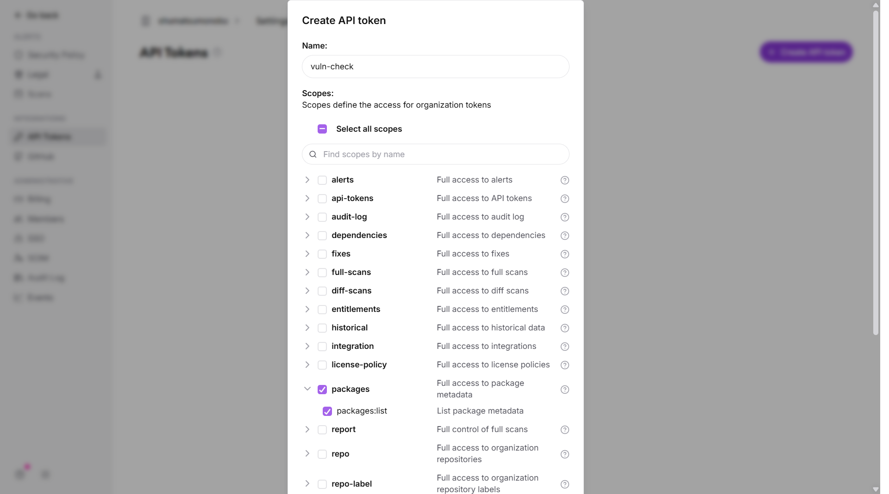
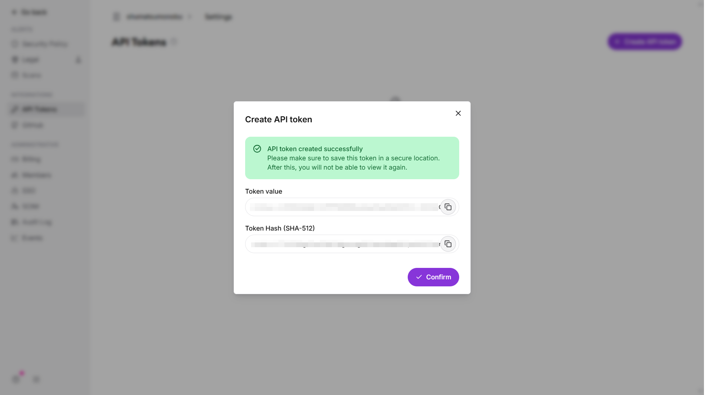
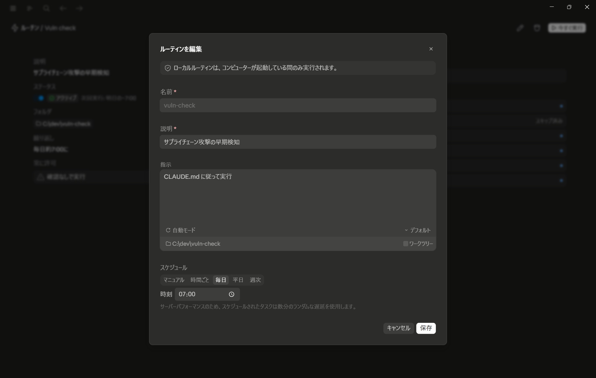
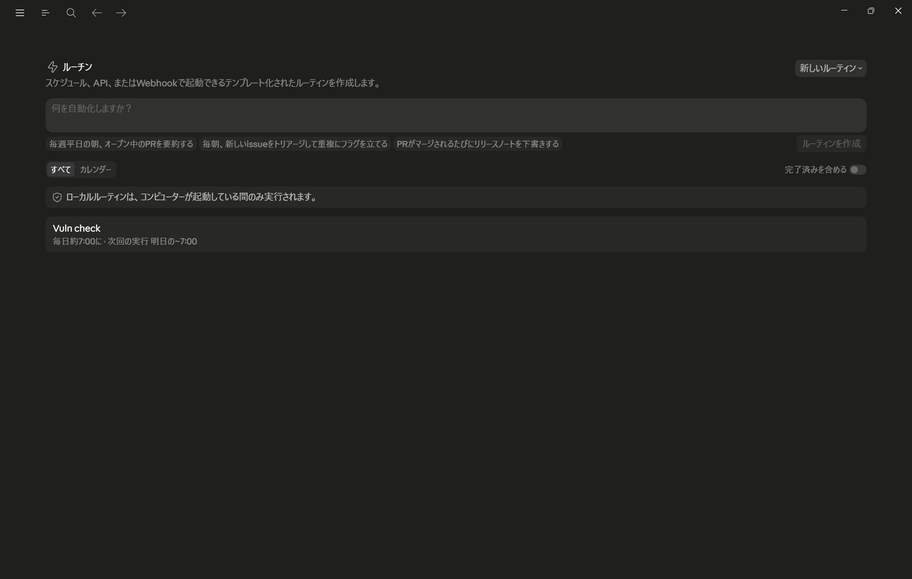

# claude-supply-chain-sentinel — サプライチェーン攻撃の自動検知

> Hunt supply chain threats before CVE — automated daily detection with Claude Code Routines, Socket.dev API, and Snyk RSS feeds.
>
> Three-phase detection: news collection (Snyk RSS) → repo matching → direct package scanning (Socket.dev, 6min detection). Runs daily via Claude Code Desktop Routine with desktop notifications.

サプライチェーン攻撃を毎朝自動で検知するシステム。Claude Code Desktop の Routine 機能で毎朝 7:00 に自動実行し、結果をデスクトップ通知で受け取る。クライアントから「この脆弱性は大丈夫か？」と聞かれる前に、自分から先手を打てる体制を作る。

## なぜこの構成か

### 検知速度の比較

サプライチェーン攻撃の検知速度はツールによって大きく異なる。以下は 2024 年の **Mini Shai-Hulud 事件**（npm に公開された悪意あるパッケージ群）での各ツールの実測検知速度。

| ツール | Mini Shai-Hulud 検知速度 | CVE 採番前に検知 | アプローチ | 料金 |
|--------|---------|:---:|-----------|------|
| **Socket.dev** | **6分** | できる | パッケージ公開直後にコードを静的解析（ネットワーク通信・難読化・シェル実行を検出） | 無料枠あり |
| Snyk | 約10時間 | 限定的 | 独自 DB + 振る舞い補完 | 無料枠あり |
| OSV.dev | 約24時間 | できない | 複数フィード集約（GHSA/OpenSSF 等） | 無料 |
| Dependabot | 1〜数日 | できない | GHSA ベース | GitHub 無料 |
| npm audit | Dependabot と同等 | できない | GHSA ベース（Dependabot と同源） | 無料 |

**Socket.dev だけが CVE 採番前に検知できる**。パッケージが npm に公開された瞬間にコードを解析し、悪意ある振る舞いを検出する。他のツールは全て脆弱性データベースへの登録待ち。

### 情報ソースの選定

では Socket.dev だけ使えばいいかというと、そうではない。Socket.dev には RSS フィードがなく、「業界で何が起きているか」というニュースは拾えない。

| ソース | RSS/API | 認証 | サプライチェーン攻撃記事 | 採用 |
|--------|---------|------|------------------------|------|
| **Snyk Blog** | RSS あり | **不要** | あり（定期的に分析記事を公開） | **採用** |
| Socket.dev | RSS **非公開** | — | あり（最速だが取得手段なし） | 不採用 |
| GitHub Advisory DB | GraphQL API あり | トークン要 | あり（将来の補助ソース候補） | 保留 |

Snyk Blog は無料・認証不要で、サプライチェーン攻撃の分析記事が定期的に掲載される。Socket.dev は API でパッケージを直接スキャンする用途で使う。

**だから両方使う:**

| | Snyk RSS（Phase 1） | Socket.dev API（Phase 3） |
|--|---------------------|--------------------------|
| 検知対象 | 業界全体の攻撃ニュース | 自分の依存パッケージ |
| 検知速度 | 約10時間 | 約6分 |
| カバー範囲 | 広い（自分に関係ない攻撃も把握） | 狭い（自分の依存だけ） |
| 精度 | 記事ベース（誤検知少） | コード解析ベース（高精度） |
| 役割 | **業界の動向把握** | **自分のリポの安全確認** |

### なぜ Claude Code Routines か

「毎朝自動実行」の基盤として何を使うかも検討した。

| 基盤 | 永続性 | 通知 | キャッチアップ | 採用 |
|------|--------|------|:---:|------|
| **Claude Code Desktop Routine（Local）** | **永続** | **デスクトップ通知** | **あり** | **採用** |
| Claude Code `/schedule`（Remote） | 7日制限 | なし | なし | 不採用 |
| node-cron（自前） | PC 起動中のみ | 自作要 | なし | 不採用 |

Routine（Local モード）は PC 起動中に自動実行され、デスクトップ通知付き。PC がオフだった日は次回起動時にキャッチアップ実行される。`/schedule` や `CronCreate` は 7 日で期限切れになるため、毎日の運用には向かない。

### 3フェーズ構成

```
Phase 1: Snyk RSS ニュース収集
  ↓ 記事あり → Phase 2 へ / 記事なし → Phase 3 へ
Phase 2: リポ該当チェック（Phase 1 の記事と自分の依存を照合）
  ↓
Phase 3: Socket.dev API で依存パッケージを直接スキャン（毎回実行）
```

- Phase 1+2 = **広く浅い**検知（ニュースベース）
- Phase 3 = **狭く深い**検知（API ベース、CVE 採番前に検知可能）

### 実行結果

毎朝、こういうレポートが自動生成される:



## セットアップ

### 1. クローン

```bash
git clone https://github.com/shumatsumonobu/claude-supply-chain-sentinel.git
cd claude-supply-chain-sentinel
```

外部パッケージ不要（Node.js 標準 API のみ使用）。`npm install` は不要。

### 2. Socket.dev API token 取得

1. [socket.dev](https://socket.dev) にアクセスし、GitHub アカウントで Sign Up
2. Settings > API Tokens > 「+ Create API token」
3. Name: 任意（例: `vuln-check`）
4. Scopes: **packages のみ**チェック（他は不要）

   

5. 「Create」→ Token value をコピー（**一度しか表示されない**）

   

### 3. ファイル設定

`.env.example` をコピーし、取得したトークンを設定:

```bash
cp .env.example .env
```

`.env` を開き、`your_token_here` を取得したトークン値に置き換える:

```
SOCKET_API_TOKEN=sktsec_xxxxx...
```

`targets.txt` を編集し、監視したいリポジトリのパスを1行1つで記載:

```
# Windows
C:\dev\my-project
# macOS / Linux
/home/user/dev/my-project
```

各リポに `package.json` があれば、その依存パッケージがスキャン対象になる。

### 4. Claude Code Desktop で Routine 登録

1. Claude Code Desktop を開く
2. Code タブ > Routines > 「新しいルーティン」 > 「ローカル」

以下を入力:

| 設定項目 | 値 |
|---------|-----|
| 名前 | `vuln-check`（任意） |
| 説明 | `サプライチェーン攻撃の早期検知` |
| 指示 | `CLAUDE.md に従って実行` |
| 許可を確認 | **自動モード** |
| フォルダーを選択 | クローンしたディレクトリ |
| スケジュール | 毎日 / 07:00（任意） |



「作成」をクリックして完了。



### 5. 動作確認

Routine 詳細画面の「今すぐ実行」をクリック。

**成功時の出力:**

- Phase 1: 「直近48時間に検知なし」または記事の日本語要約
- Phase 2: 記事があれば該当チェック結果、なければスキップ
- Phase 3: 各パッケージのスキャン結果（アラートがあればテーブル形式で表示）

3つの Phase が順に実行され、Phase 3 まで到達していれば成功。

**うまく動かない場合:**

- `.env` のトークンが正しいか確認（`sktsec_` で始まる文字列）
- `targets.txt` のパスが存在するか確認
- 対象リポに `package.json` があるか確認

## 仕組み

全体の動作は [`CLAUDE.md`](CLAUDE.md) が制御する。Claude Code Desktop の Routine は起動時に CLAUDE.md を読み、書かれた手順に従って実行する。

### Phase 1: Snyk RSS ニュース収集（[crawler.js](crawler.js)）

1. `fetch()` で Snyk Blog の RSS フィード（`https://snyk.io/blog/feed/`）を取得
2. XML を正規表現でパースし、`<item>` からタイトル・リンク・公開日・概要を抽出
3. `pubDate` が直近 48 時間以内の記事だけに絞り込み
4. タイトル + 概要にセキュリティ関連キーワード（`supply chain`, `malicious`, `typosquatting` 等）が含まれるかチェック
5. マッチした記事を `logs/feed-YYYY-MM-DD.json` に保存
6. Claude が記事を読み、対象パッケージ・攻撃手法・影響範囲を日本語で要約

### Phase 2: リポ該当チェック

スクリプトなし。Claude が以下を自動で行う:

1. `targets.txt` から監視対象リポのパス一覧を取得
2. Phase 1 で検出された記事から対象パッケージ名を特定
3. 各リポの `package.json` を読み、該当パッケージが依存に含まれるか照合
4. 該当があれば、リポ名・パッケージ名・バージョン・対応案を警告
5. 該当なしなら「対象リポへの影響なし」と1行報告

### Phase 3: Socket.dev パッケージスキャン（[scanner.js](scanner.js)）

1. 各リポの `package.json` を読み、`dependencies` + `devDependencies` からパッケージ名とバージョンを抽出（`^4.18.0` → `4.18.0` にプレフィックス除去）
2. Socket.dev REST API にリクエスト:
   ```
   GET https://api.socket.dev/v0/npm/{package}/{version}/issues
   Authorization: Bearer {token}
   ```
3. レスポンスから severity が `critical` または `high`、かつ category が `supplyChainRisk` または `vulnerability` のアラートのみ抽出
4. 結果を `logs/scan-YYYY-MM-DD.json` に保存
5. Claude がアラートを読み、パッケージ名・検出内容・対応案を日本語で報告

### CLAUDE.md による Phase 遷移制御

```
Phase 1 → 記事あり → Phase 2 → Phase 3
Phase 1 → 記事なし → Phase 3（Phase 2 をスキップ）
```

Phase 3 は Phase 1/2 の結果に関わらず**毎回実行**する。

**実装時のハマりポイント**: Claude に複数ステップを確実に実行させるには、CLAUDE.md の各ステップ末尾に「次は Phase X に進む」と明記する必要がある。これを書かないと Claude は Phase 1 の報告後に「終了」と判断し、Phase 3 をスキップすることがある。Phase 遷移を暗黙に任せず、明示的に指示するのがコツ。

## テスト

自分の環境で動作確認するには、テスト用のダミープロジェクトを作る。

```bash
mkdir vuln-check-target
```

以下の `package.json` を `vuln-check-target/` 内に作成（意図的に脆弱なバージョンを含む）:

```json
{
  "name": "vuln-check-target",
  "version": "1.0.0",
  "private": true,
  "dependencies": {
    "express": "^4.18.0",
    "lodash": "^4.17.21",
    "ua-parser-js": "^0.7.33",
    "node-ipc": "^10.1.0",
    "event-stream": "^4.0.1",
    "colors": "^1.4.0"
  }
}
```

`targets.txt` にこのダミープロジェクトの**絶対パス**を追加:

```
# 例（Windows）
C:\dev\vuln-check-target
# 例（macOS / Linux）
/home/user/dev/vuln-check-target
```

Routine の「今すぐ実行」で統合テスト。

### 期待される結果

| パッケージ | 期待 | 理由 |
|-----------|------|------|
| express 4.18.0 | High CVE x4 検出 | 既知の脆弱性あり |
| lodash 4.17.21 | High CVE x1 検出 | Prototype Pollution 等 |
| ua-parser-js 0.7.33 | clean | 悪意あるのは 0.7.29 |
| node-ipc 10.1.0 | clean | 悪意あるのは 10.1.1（protestware） |
| event-stream 4.0.1 | clean | 悪意あるのは 3.3.6 |
| colors 1.4.0 | clean | 悪意あるのは 1.4.1+（protestware） |

## ファイル構成

```
claude-supply-chain-sentinel/
  CLAUDE.md          # Routine 起動時の行動指示（Phase 1 + 2 + 3）
  crawler.js         # Phase 1: Snyk RSS クローラー
  scanner.js         # Phase 3: Socket.dev API スキャナー
  package.json       # プロジェクト設定（type: module）
  targets.txt        # 監視対象リポ一覧（1行1パス）
  .env.example       # API トークンのテンプレート
  .gitignore         # .env と logs/ を除外
  screenshots/       # セットアップ手順用スクリーンショット
  logs/              # 実行結果（自動生成、git 管理外）
    feed-YYYY-MM-DD.json   # Phase 1 の取得結果
    scan-YYYY-MM-DD.json   # Phase 3 のスキャン結果
```

## 制限事項

- Claude Code Desktop のサブスクリプションが必要（Routine 機能を使うため）
- Node.js がインストールされている必要がある
- Socket.dev 無料枠は 500 スキャン/月（例: 6パッケージ x 30日 = 180スキャン/月で十分足りる）
- 現在 npm のみ対応（PyPI, Go modules 等は Socket.dev API が対応次第追加可能）
- Windows で動作確認済み。macOS / Linux でも動作する想定（パス区切りは `path.join` で吸収）

## 参考

- [Socket.dev](https://socket.dev) — パッケージの振る舞い解析プラットフォーム
- [Socket.dev REST API ドキュメント](https://docs.socket.dev/reference/introduction)
- [Snyk Blog](https://snyk.io/blog/) — セキュリティ分析記事
- [Claude Code Routines ドキュメント](https://docs.anthropic.com/en/docs/claude-code/routines)
